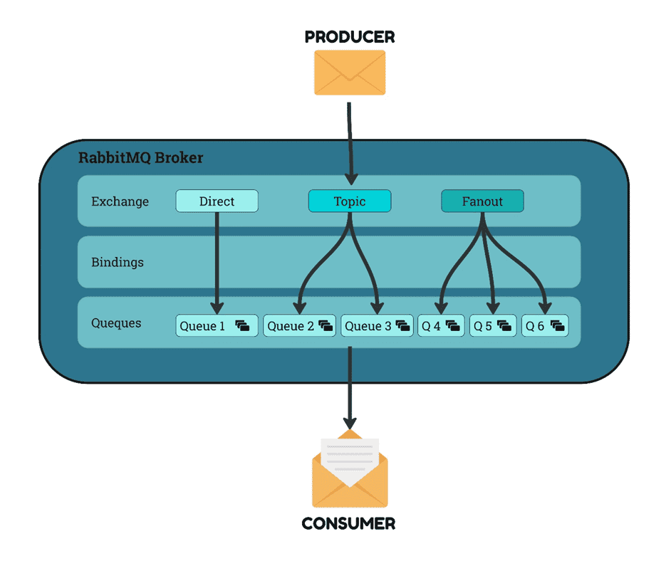

## RabbitMQ

O [RabbitMQ](https://www.rabbitmq.com) é um [Message Broker](#) open-source que implementa o Advanced Message Queuing Protocol (AMQP). Ele atua recebendo [Messages (Mensagens)](#messages-mensagens) dos Producers (aplicações que enviam [Messages (Mensagens)]) e as encaminha para Consumers (aplicações que recebem mensagens) através de [Queues (Filas)](#queues-filas) e [Exchanges](#exchanges), permitindo uma comunicação assíncrona e desacoplada.

**Consumer (Consumidor):** O componente que recebe e processa mensagens. <br/>
**Producer (Produtor):** O componente que envia mensagens.



### Queues (Filas)

As filas (ou queues em inglês) são estruturas de dados onde as mensagens são armazenadas até que sejam consumidas. As mensagens são enviadas para um [Message Broker](#message-broker) e são colocadas em uma fila, onde aguarda até ser processada por um consumidor.

#### Ciclo de vida das Filas

- **Adição de Mensagens (Enqueue):**
    - Quando uma mensagem é enviada para uma fila, ela é adicionada ao final da fila.
    - A ordem de chegada das mensagens é preservada.
- **Processamento de Mensagens (Dequeue):**
    - As mensagens são removidas da fila na mesma ordem em que foram adicionadas.
    - O primeiro item adicionado à fila é o primeiro a ser removido e processado pelo consumidor.

### Exchanges

Exchanges são componentes em um [Message Broker](#message-broker) que recebem as [Messages (Mensagens)](#messages-mensagens) de Producers e as roteiam para as [Queues (Filas)](#queues-filas) de acordo com regras específicas. Existem vários tipos de exchanges, cada um com um comportamento de roteamento diferente.

#### Tipos de Exchanges

1. **Direct Exchange:**
    - Roteia mensagens para filas com base em uma chave de roteamento exata. Se a chave de roteamento da mensagem coincidir com a chave de roteamento da fila, a mensagem é entregue a essa fila.
    - Exemplo: Uma mensagem com a chave "info" será roteada apenas para filas que estão vinculadas à exchange com a chave "info".
    
2. **Fanout Exchange:**
    - Roteia mensagens para todas as filas ligadas a ela, independentemente da chave de roteamento.
    - Exemplo: Quando uma mensagem é enviada para uma fanout exchange, todas as filas ligadas a essa exchange recebem a mensagem.
    
3. **Topic Exchange:**
    - Roteia mensagens com base em padrões de correspondência de chave de roteamento, permitindo roteamento flexível com caracteres coringa (por exemplo, `*` e `#`).
    - Exemplo: Uma mensagem com a chave "user.signup" pode ser roteada para filas que estão interessadas em eventos "user.*" ou "*.signup".
    
4. **Headers Exchange:**
    - Roteia mensagens com base nos cabeçalhos de mensagem em vez de chaves de roteamento. A mensagem é roteada para filas que têm uma correspondência exata ou parcial dos cabeçalhos especificados.
    - Exemplo: Se a mensagem tiver um cabeçalho `{"type": "report"}`, será roteada para filas que exigem esse cabeçalho.

### Message Broker

Um Message Broker é um software que permite a comunicação entre diferentes sistemas ou componentes por meio do envio e recebimento de [Messages (Mensagens)](#messages). Ele garante que as mensagens sejam entregues de forma eficiente, confiável e organizada.

#### Messages (Mensagens)

As Mensagens de um [Message Broker](#message-broker) podem ser diferentes tipos de informação, como comandos, eventos, dados de estado ou qualquer outra informação que precisa ser comunicada entre sistemas ou componentes.

### Executar Projeto
1. Clone o Repositório.

   ```
   git clone https://github.com/tdayko/rabbitmq-lab
   ```
2. Execute o comando docker ou o atalho usando o Makefile

   ```
   docker compose up --build
   ```

   ```
   make run-docker
   ```


